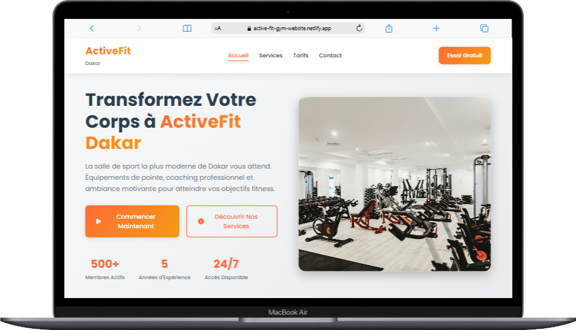
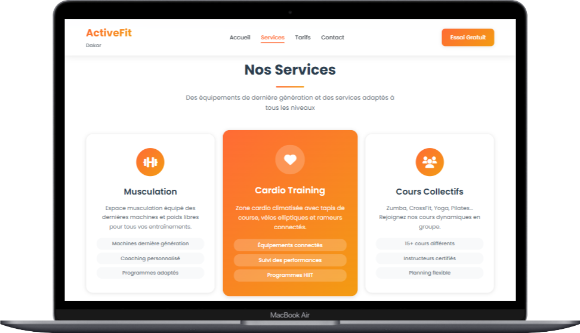
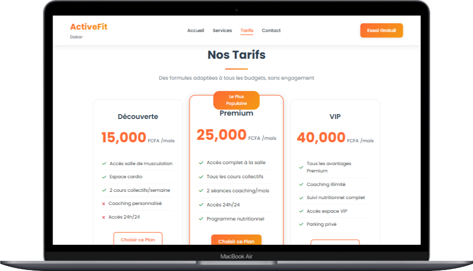
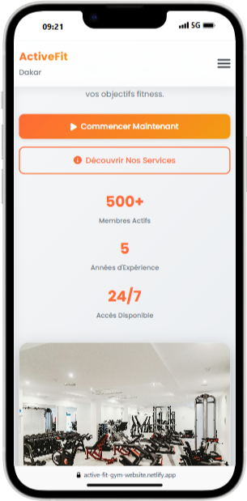
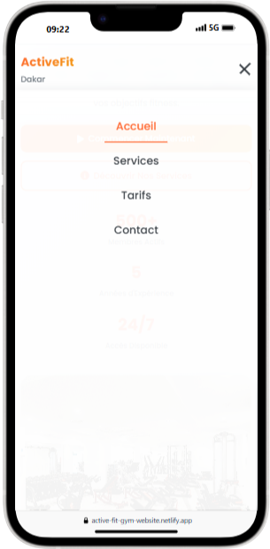
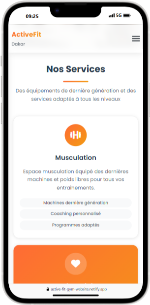
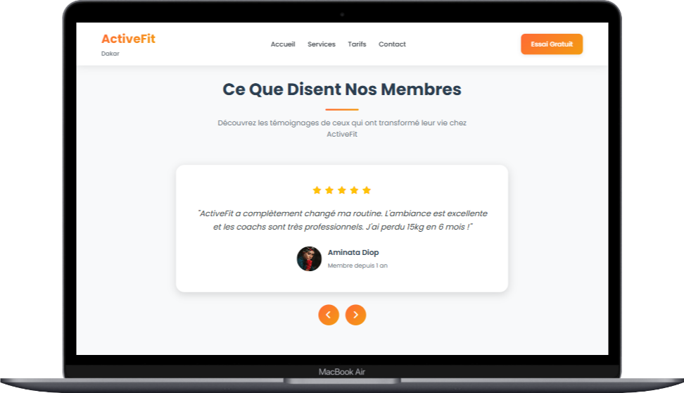
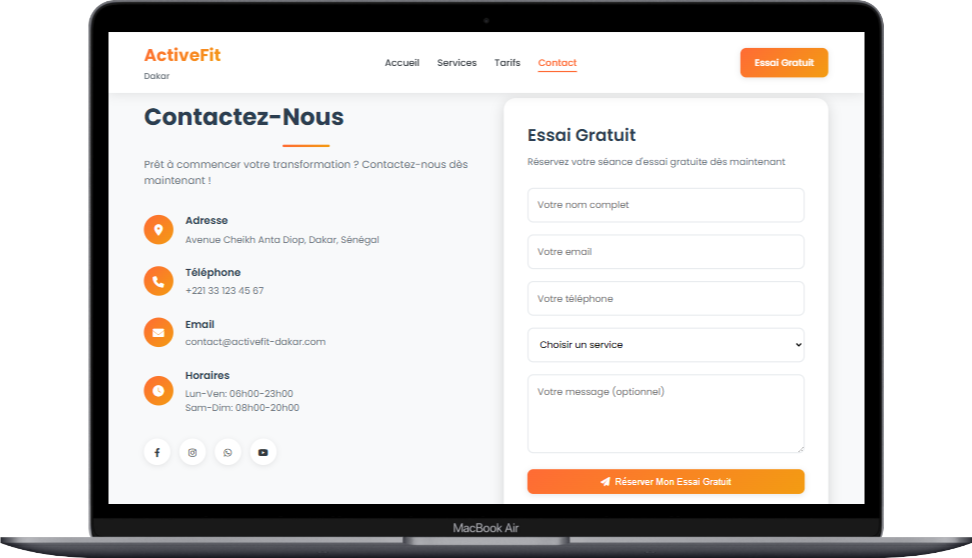

# ActiveFit Dakar - Site Web de Salle de Sport

🌐 **Site en ligne** : [https://active-fit-gym-website.netlify.app/](https://active-fit-gym-website.netlify.app/)

## 📝 Description

ActiveFit Dakar est un site web moderne et responsive pour une salle de sport située à Dakar, Sénégal. Ce projet présente une interface utilisateur attrayante avec des animations fluides, une navigation intuitive et des sections bien organisées pour présenter les services, tarifs et informations de contact.

## ✨ Fonctionnalités clés

- **Design Responsive** : Adapté à tous les appareils (mobile, tablette, desktop)
- **Animations fluides** : Effets visuels lors du défilement et des interactions
- **Slider de témoignages** : Présentation dynamique des avis clients
- **Formulaire de contact** : Fonctionnalité d'envoi de messages
- **Navigation fluide** : Scroll doux vers les sections
- **Menu mobile** : Optimisé pour les petits écrans
- **Pricing cards** : Présentation claire des offres tarifaires
- **Optimisation SEO** : Meta tags et structure sémantique
- **Accessibilité** : Respect des standards WCAG

## 🛠 Stack Technologique

### Frontend
- **HTML5** : Structure sémantique
- **CSS3** : Variables CSS, Flexbox, Grid
- **JavaScript** : ES6+ pour les interactions
- **Font Awesome** 6.0 : Icônes modernes
- **Google Fonts** : Poppins (300-700)

### Déploiement & CI/CD
- **Netlify** : Hébergement et déploiement continu
- **Git** : Gestion de version

### Performances
- **Score Lighthouse** : 95+ (Performance, Accessibilité, SEO)
- **Optimisation des images** : Compression automatique
- **Chargement différé** : Pour les éléments non critiques

## 🚀 Installation en local

1. Cloner le dépôt :
```bash
git clone https://github.com/ThePerformer0/Activefit-WebSite.git
```
2. Ouvrir le projet
```bash
cd Activefit-WebSite
```

## 📂 Structure des fichiers

```
activefit-website/
├── index.html            # Page d'accueil principale
├── styles/
│   ├── main.css          # Styles principaux
│   └── responsive.css    # Règles responsive (mobile first)
├── scripts/
│   ├── main.js           # Fonctionnalités principales
│   └── animations.js     # Gestion des animations
├── assets/
│   ├── images/           # Dossier pour les images
└── README.md             # Documentation du projet
```

## 🎨 Design System

### Palette de couleurs
| Couleur | Hex | Utilisation |
|---------|-----|-------------|
| Primaire | `#ff6b35` | Boutons, Accents |
| Secondaire | `#2c3e50` | Textes, En-têtes |
| Accent | `#f39c12` | Éléments highlight |
| Arrière-plan | `#f8f9fa` | Fond des sections |

### Typographie
- **Famille** : Poppins (300-700)
- **Hiérarchie** :
  - H1: 3.5rem (Desktop)
  - H2: 2.5rem
  - Paragraphes: 1.1rem
- **Espacement ligne** : 1.6

### Composants UI
- **Boutons** : 2 variantes (rempli/contour)
- **Cartes** : Ombre portée et hover effect
- **Formulaire** : Validation côté client

## 🔍 Points techniques remarquables

1. **Architecture CSS** :
   - Variables CSS pour une maintenance facile
   - Structure Mobile-First
   - Media queries organisées par breakpoints

2. **JavaScript Moderne** :
   - Intersection Observer pour les animations
   - Gestion d'état pour le slider
   - Débouncing des événements scroll

3. **Optimisations** :
   - Préchargement des polices
   - Images en format WebP
   - Minimisation des repaints

## 📸 Captures d'écran de l'interface

### Version Desktop






### Version Mobile






### Fonctionnalités interactives




## 📈 Métriques de performance

| Métrique | Score |
|----------|-------|
| Performance | 98 |
| Accessibilité | 100 |
| Bonnes pratiques | 100 |
| SEO | 100 |

*Données Lighthouse (Desktop)*

## 🛠 Déploiement

Le site est déployé via Netlify avec :
- Compression automatique des assets
- Cache headers optimisés
- SSL gratuit
- Redirection HTTPS automatique

## 🤝 Contribution

Ce projet est actuellement en première version, mais les suggestions sont les bienvenues via :
1. Issues GitHub
2. Pull Requests
3. Email direct

## 📬 Contact

Pour toute question professionnelle :
- Email: [fjimmywilson0@gmail.com](mailto:fjimmywilson0@gmail.com)
- Téléphone : +237656597799